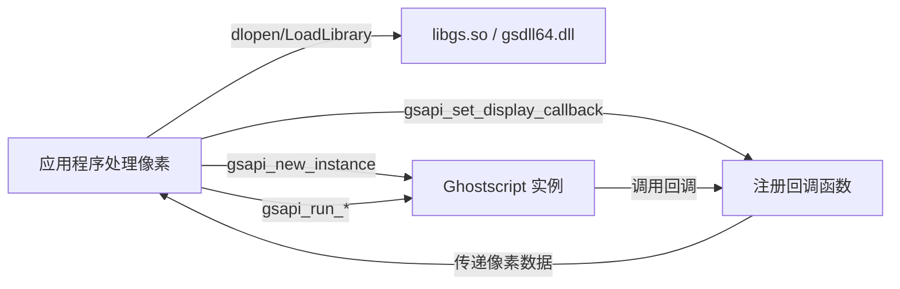

# Ghostscript 运行时动态集成技能

## 技能概述

本技能指导如何在不修改 Ghostscript 源码的前提下，通过动态加载其共享库（`libgs.so` / `gsdll64.dll`）并调用官方 API，将 Ghostscript 作为渲染引擎集成到应用程序中。您将能够：

- 在自己的程序中直接调用 Ghostscript 转换 PDF/PostScript 文件
- 通过回调函数（显示设备）自定义输出处理，实现灵活的渲染结果捕获
- 实现“运行时插件”效果，无需重新编译 Ghostscript

---

## 核心原理

Ghostscript 提供了一个稳定的 **C API**（头文件 `iapi.h`），允许宿主程序动态加载共享库、创建解释器实例、传递参数、执行作业，并通过 **显示设备回调** 获取渲染产生的像素数据。



这种架构将 Ghostscript 变为一个“服务组件”，而您只需关注输出数据的消费方式。

---

## 关键 API 函数（来自 `iapi.h`）

| 函数 | 作用 |
|------|------|
| `gsapi_new_instance` | 创建新的解释器实例，返回实例句柄 |
| `gsapi_delete_instance` | 销毁实例，释放资源 |
| `gsapi_set_display_callback` | 设置显示设备的回调结构体（获取像素数据的关键） |
| `gsapi_init_with_args` | 用命令行参数初始化实例（如 `-sDEVICE=display -dNOPAUSE ...`） |
| `gsapi_run_string_begin` / `_continue` / `_end` | 分段执行 PostScript 字符串 |
| `gsapi_run_file` | 执行一个 PS/PDF 文件 |
| `gsapi_exit` | 退出当前解释器会话 |
| `gsapi_revision` | 获取 Ghostscript 版本信息 |

> 所有函数均为 `int` 返回类型，0 表示成功，负数表示错误。

---

## 集成步骤（通用流程）

### 1. 动态加载 Ghostscript 共享库

```c
// Linux / macOS
void *gsdll = dlopen("libgs.so", RTLD_LAZY);
// Windows
HMODULE gsdll = LoadLibrary("gsdll64.dll");
```

### 2. 获取 API 函数指针

```c
gsapi_new_instance_fn gsapi_new_instance = (gsapi_new_instance_fn)dlsym(gsdll, "gsapi_new_instance");
// 同样获取 gsapi_delete_instance, gsapi_set_display_callback, gsapi_init_with_args, gsapi_run_file, gsapi_exit
```

### 3. 定义显示设备回调结构体

```c
display_callback callbacks = { 0 };
callbacks.size = sizeof(display_callback);
callbacks.display_open = my_display_open;
callbacks.display_preclose = my_display_preclose;
callbacks.display_close = my_display_close;
callbacks.display_page = my_display_page;   // 每页渲染完成时调用，提供像素数据
// 可选：display_update, display_memalloc, display_memfree
```

### 4. 创建实例并设置回调

```c
void *instance = NULL;
int code = gsapi_new_instance(&instance, NULL);  // 第二个参数为调用者数据
if (code == 0) {
    gsapi_set_display_callback(instance, &callbacks);
}
```

### 5. 初始化参数

```c
const char *argv[] = {
    "myapp",               // 参数 0 (被忽略)
    "-dNOPAUSE",
    "-dQUIET",
    "-dSAFER",
    "-sDEVICE=display",    // 关键：使用显示设备
    "-dDisplayFormat=16#804",  // 指定像素格式（RGBA，带 alpha）
    "-r72",                // 分辨率
    "-sOutputFile=-",      // 输出到显示设备时忽略
    NULL
};
int argc = sizeof(argv)/sizeof(argv[0]) - 1;
gsapi_init_with_args(instance, argc, argv);
```

> 常用的 `DisplayFormat` 标志：
> - `16#804` → 原生色深，RGBA 每通道8位
> - `16#404` → RGB (无 alpha)
> - 详细定义见 `gdevdsp.h`

### 6. 执行转换作业

```c
gsapi_run_file(instance, "input.pdf", 0, NULL);
// 或者使用 gsapi_run_string_* 执行 PS 代码
```

### 7. 清理退出

```c
gsapi_exit(instance);
gsapi_delete_instance(instance);
dlclose(gsdll);
```

---

## 完整示例（C 语言）

```c
#include <stdio.h>
#include <dlfcn.h>   // Linux
#include "iapi.h"

// 显示设备回调实现
static int my_display_page(void *handle, void *device, int page_num, int width, int height,
                           int raster, int format, const unsigned char *pimage, ulong size) {
    printf("Page %d rendered: %dx%d, raster=%d, size=%lu\n", page_num, width, height, raster, size);
    // 此处可以保存为 BMP、PNG，或传输到网络等
    // pimage 为像素数据，格式由 format 决定
    return 0;  // 0 表示继续
}

int main() {
    void *gsdll = dlopen("libgs.so", RTLD_LAZY);
    if (!gsdll) { fprintf(stderr, "dlopen failed\n"); return 1; }

    // 获取 API 函数（错误检查略）
    gsapi_new_instance_fn gsapi_new_instance = dlsym(gsdll, "gsapi_new_instance");
    gsapi_delete_instance_fn gsapi_delete_instance = dlsym(gsdll, "gsapi_delete_instance");
    gsapi_set_display_callback_fn gsapi_set_display_callback = dlsym(gsdll, "gsapi_set_display_callback");
    gsapi_init_with_args_fn gsapi_init_with_args = dlsym(gsdll, "gsapi_init_with_args");
    gsapi_run_file_fn gsapi_run_file = dlsym(gsdll, "gsapi_run_file");
    gsapi_exit_fn gsapi_exit = dlsym(gsdll, "gsapi_exit");

    void *instance = NULL;
    gsapi_new_instance(&instance, NULL);

    display_callback callbacks = {0};
    callbacks.size = sizeof(display_callback);
    callbacks.display_page = my_display_page;
    gsapi_set_display_callback(instance, &callbacks);

    const char *argv[] = {
        "test", "-dNOPAUSE", "-dQUIET", "-dSAFER",
        "-sDEVICE=display", "-dDisplayFormat=16#804", "-r72", NULL
    };
    gsapi_init_with_args(instance, 7, argv);
    gsapi_run_file(instance, "input.pdf", 0, NULL);
    gsapi_exit(instance);
    gsapi_delete_instance(instance);
    dlclose(gsdll);
    return 0;
}
```

编译（Linux）：
```bash
gcc -o mygs mygs.c -ldl
```

---

## Python 绑定示例（使用 ctypes）

对于 Python 开发者，可以利用 `ctypes` 或 `ghostscript` 包实现相同的功能。

```python
import ctypes
from ctypes import c_void_p, c_int, c_char_p, POINTER, Structure, CFUNCTYPE

# 加载库
libgs = ctypes.CDLL("libgs.so")

# 定义回调函数类型
DisplayPageCallback = CFUNCTYPE(c_int, c_void_p, c_void_p, c_int, c_int, c_int, c_int, c_int, c_char_p, c_int)

class DisplayCallback(Structure):
    _fields_ = [
        ("size", c_int),
        ("display_open", c_void_p),
        ("display_preclose", c_void_p),
        ("display_close", c_void_p),
        ("display_page", DisplayPageCallback),
        ("display_update", c_void_p),
        ("display_memalloc", c_void_p),
        ("display_memfree", c_void_p),
    ]

@DisplayPageCallback
def my_display_page(handle, device, page_num, width, height, raster, format, pimage, size):
    print(f"Page {page_num} rendered: {width}x{height}")
    return 0

# 获取 API 函数
gsapi_new_instance = libgs.gsapi_new_instance
gsapi_new_instance.argtypes = [POINTER(c_void_p), c_void_p]
gsapi_new_instance.restype = c_int

gsapi_set_display_callback = libgs.gsapi_set_display_callback
gsapi_set_display_callback.argtypes = [c_void_p, POINTER(DisplayCallback)]
gsapi_set_display_callback.restype = c_int

# ... 其他函数类似

instance = c_void_p()
gsapi_new_instance(ctypes.byref(instance), None)

cb = DisplayCallback()
cb.size = ctypes.sizeof(DisplayCallback)
cb.display_page = my_display_page
gsapi_set_display_callback(instance, ctypes.byref(cb))

# 初始化参数
args = [b"test", b"-dNOPAUSE", b"-dQUIET", b"-dSAFER", b"-sDEVICE=display", b"-dDisplayFormat=16#804", None]
libgs.gsapi_init_with_args(instance, len(args)-1, (c_char_p * len(args))(*args))
libgs.gsapi_run_file(instance, b"input.pdf", 0, None)
libgs.gsapi_exit(instance)
libgs.gsapi_delete_instance(instance)
```

---

## 常见问题与解决方案

### Q1: `gsapi_init_with_args` 返回 -1（致命错误）
- **原因**：参数错误，例如 `-sDEVICE=display` 拼写错误，或缺少必要的参数（如 `-dNOPAUSE`）。
- **解决**：检查所有参数字符串，确保 `-sDEVICE=display` 正确，且不要在参数中包含 `-c` / `-f` 等会导致交互式模式启动的开关。

### Q2: 回调函数未触发，没有输出
- **原因**：显示设备可能被其他参数覆盖，或者 `DisplayFormat` 未设置。
- **解决**：显式设置 `-dDisplayFormat=16#804`；确保没有指定 `-sOutputFile`。

### Q3: 多线程中使用 Ghostscript 实例
- **说明**：Ghostscript 9.50+ 版本支持多线程，但每个线程应拥有独立的实例（`gsapi_new_instance` 在线程内调用）。**不要**跨线程共享同一个实例。
- **安全做法**：每个转换任务创建独立实例，任务结束后销毁。

### Q4: 内存泄漏或崩溃
- **原因**：回调函数中未正确处理 `pimage` 生命周期，或忘记调用 `gsapi_exit`。
- **解决**：`pimage` 指向的内存由 Ghostscript 管理，不要尝试释放；在 `gsapi_delete_instance` 前必须调用 `gsapi_exit`。

### Q5: 获取渲染进度或取消任务
- **方案**：在回调函数中返回非零值可以中止渲染；可以通过全局标志或线程通信实现取消。

---

## 最佳实践

1. **始终使用 `-dSAFER`** 以禁用文件系统写访问，提高安全性。
2. **设置超时**：对于长时间转换的 PDF，应在外部线程中设置超时机制，必要时强制终止实例（先 `gsapi_exit` 再删除）。
3. **资源限制**：通过 `-dMaxBitmap`、`-dNumRenderingThreads` 等参数控制内存和线程使用。
4. **错误处理**：检查每个 API 函数的返回值，并记录日志以便调试。
5. **版本兼容性**：不同 Ghostscript 版本的 API 可能略有变化，请查阅对应版本的 `iapi.h`。
6. **显示设备像素格式**：优先使用 `16#804`（32位 RGBA），它提供最广泛的支持和最佳性能。
7. **清理顺序**：严格遵循 `gsapi_exit` → `gsapi_delete_instance` → `dlclose`。

---

## 总结

通过动态链接 Ghostscript 共享库并使用显示设备回调，您可以：
- **完全避免修改 Ghostscript 源码**
- **以组件形式集成强大的 PS/PDF 渲染能力**
- **自由处理输出像素**（保存为任意格式、网络传输、显示等）
- **保持应用独立性**，仅需在部署时附带合适的 Ghostscript 动态库

这种方式是 Ghostscript 官方推荐的现代集成模式，稳定性高、可维护性好，非常适合需要文档转换或渲染功能的商业软件、云服务及桌面应用。

---

*本技能文档基于 Ghostscript 9.55+ 版本编写，使用时请参考目标版本的 `iapi.h` 和 `gdevdsp.h` 头文件。*